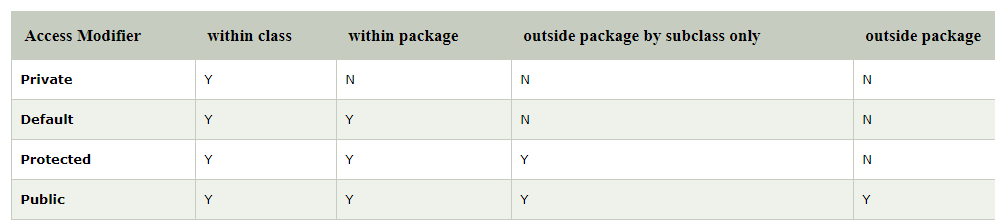
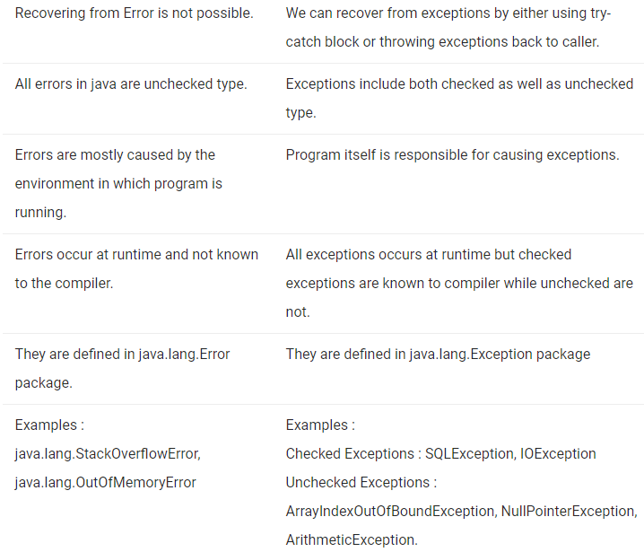

Java Core Concepts
=====

**Static variable**
If the value of variable is not varied ,then we declare variable as Static.
If the variable is declared with static keyword in class ,then its copy is shared with all objects of that class.
static variable is also called as class variable.compiler always execute static variable first . Its priority for execution is first.

**Final Variable**
If we declare any variable as final, we can’t modify its contents since it is final, and if we modify it then we get Compile Time Error.

**Static final variarable**
To create CONSTANT 
1.Initialization of variable Mandatory : If the static variable declared as final, then we have to perform initialization explicitly whether we are using it or not and JVM won’t provide any default value for the final static variable.

2.Initialization before class loading : For final static variable, it is compulsory that we should perform initialization before class loading completion. We can initialize a final static variable at the time of declaration.

3.Initialize inside a static block : We can also initialize a final static variable inside a static block because we should initialize a final static variable before class and we know that static block is executed before main() method.
  Apart from the above mentioned methods, if we try to initialize a final static variable anywhere else then we will get compile time error.
  
  **Final class**
   The class cannot be subclassed. Whenever we declare any class as final, it means that we can’t extend that class or that class can’t be extended or we can’t make subclass of that class.
   
**Final method**
 The method cannot be overridden by a subclass. Whenever we declare any method as final, then it means that we can’t override that method.
* Note* : If a class is declared as final then by default all of the methods present in that class are automatically final but variables are not.

**finally**
The finally keyword is used in association with a try/catch block and guarantees that a section of code will be executed, even if an exception is thrown. The finally block will be executed after the try and catch blocks, but before control transfers back to its origin.

****Package****

A group of interrelaed classes and interfaces.

*Packages are used for:*
Preventing naming conflicts

Making searching/locating and usage of classes, interfaces, enumerations and annotations easier

Providing controlled access: protected and default have package level access control. A protected member is accessible by classes in the same package and its subclasses. A default member (without any access specifier) is accessible by classes in the same package only.

***Access Modifiers***

The access modifiers in Java specifies the accessibility or scope of a field, method, constructor, or class. We can change the access level of fields, constructors, methods, and class by applying the access modifier on it.

There are four types of Java access modifiers:

**If you make any class constructor private, you cannot create the instance of that class from outside the class.**

EXCEPTIONS
=====

An exception is an unwanted or unexpected event, which occurs during the execution of a program i.e at run time, that disrupts the normal flow of the program’s instructions.

*Difference between ERROR and EXCEPTION*

**Types of Exception**
1) BuiltIn
2) Userdefined

Built-in exceptions are the exceptions which are available in Java libraries.
e.g. ArithmeticException
ArrayIndexOutOfBoundsException etc.

Sometimes, the built-in exceptions in Java are not able to describe a certain situation. In such cases, user can also create exceptions which are called ‘user-defined Exceptions’. user defined exceptions typically extend Exception class

Java exception handling is managed via five keywords: try, catch, throw, throws, and finally. 

**THROW and THROWS**
The throw keyword in Java is used to explicitly throw an exception from a method or any block of code. We can throw either checked or unchecked exception. The throw keyword is mainly used to throw custom exceptions.

throws is a keyword in Java which is used in the signature of method to indicate that this method might throw one of the listed type exceptions. The caller to these methods has to handle the exception using a try-catch block.

OOPS
=====
https://www.geeksforgeeks.org/object-oriented-programming-oops-concept-in-java/

**Association , Composition , Aggrigation**
https://www.geeksforgeeks.org/association-composition-aggregation-java/

Java Variable
=====
https://www.javatpoint.com/java-variables

A variable is a container which holds the value while the java program is executed. A variable is assigned with a datatype.
Variable is a name of memory location. There are three types of variables in java: local, instance and static.
There are two types of data types in java: primitive and non-primitive.

There are three types of variables in java:
**local variable
**instance variable
**static variable

1) Local Variable
A variable declared inside the body of the method is called local variable. You can use this variable only within that method and the other methods in the class aren't even aware that the variable exists.
A local variable cannot be defined with "static" keyword.

2) Instance Variable
A variable declared inside the class but outside the body of the method, is called instance variable. It is not declared as static.
It is called instance variable because its value is instance specific and is not shared among instances.

3) Static variable
A variable which is declared as static is called static variable. It cannot be local. You can create a single copy of static variable and share among all the instances of the class. Memory allocation for static variable happens only once when the class is loaded in the memory.

**JAVA IDENTIFIERS**
In programming languages, identifiers are used for identification purpose. In Java, an identifier can be a class name, method name, variable name or a label. 

**Keywords or Reserved words**
are the words in a language that are used for some internal process or represent some predefined actions. These words are therefore not allowed to use as a variable names or objects. Doing this will result into a compile time error.

**Continue - after continue control goes to the start of the loop
Break - after breakcontrol goes to the end of the loop

**Diffrence between For Each and for loop**
1) The enhanced for loop executes in sequence. i.e  the counter is always increased by one, where as in for loop you can change the step as per your wish e.g doing something like i=i+2; to loop every second element in an array or collection.

2) The enhanced for loop can only iterate in incremental order. we cannot configure it to go in decrement. i.e in for loop we can write i-- in step counter to go backward.

**String**
stringBuffer peer class of String.StringBuffer is growable and writable character sequence
String class objects are immutable and it is fixed length.
StringBuilder is same as StringBuffer for both objects are mutable.
stringBuilder and String buffer use in multithreading and StringBuffer has synchonization but string builder not have syntronization
to use object of StringBuilder is not safe

