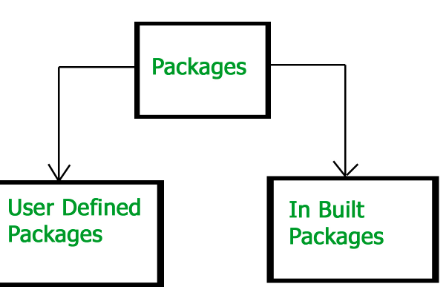

Java Core Concepts
=====

**Static variable**
If the value of variable is not varied ,then we declare variable as Static.
If the variable is declared with static keyword in class ,then its copy is shared with all objects of that class.
static variable is also called as class variable.compiler always execute static variable first . Its priority for execution is first.

**Final Variable**
If we declare any variable as final, we can’t modify its contents since it is final, and if we modify it then we get Compile Time Error.

**Static final variarable**
To create CONSTANT 
1.Initialization of variable Mandatory : If the static variable declared as final, then we have to perform initialization explicitly whether we are using it or not and JVM won’t provide any default value for the final static variable.

2.Initialization before class loading : For final static variable, it is compulsory that we should perform initialization before class loading completion. We can initialize a final static variable at the time of declaration.

3.Initialize inside a static block : We can also initialize a final static variable inside a static block because we should initialize a final static variable before class and we know that static block is executed before main() method.
  Apart from the above mentioned methods, if we try to initialize a final static variable anywhere else then we will get compile time error.
  
  **Final class**
   The class cannot be subclassed. Whenever we declare any class as final, it means that we can’t extend that class or that class can’t be extended or we can’t make subclass of that class.
   
**Final method**
 The method cannot be overridden by a subclass. Whenever we declare any method as final, then it means that we can’t override that method.
* Note* : If a class is declared as final then by default all of the methods present in that class are automatically final but variables are not.

**finally**
The finally keyword is used in association with a try/catch block and guarantees that a section of code will be executed, even if an exception is thrown. The finally block will be executed after the try and catch blocks, but before control transfers back to its origin.

****Package****

A group of interrelaed classes and interfaces.

*Packages are used for:*
Preventing naming conflicts

Making searching/locating and usage of classes, interfaces, enumerations and annotations easier

Providing controlled access: protected and default have package level access control. A protected member is accessible by classes in the same package and its subclasses. A default member (without any access specifier) is accessible by classes in the same package only.

